<div align="center">

<picture>
  <source media="(prefers-color-scheme: dark)" srcset="docs/readme/hero-dark.svg">
  
</picture>

<picture>
  <source media="(prefers-color-scheme: dark)" srcset="docs/readme/tagline-dark.svg">
  
</picture>


<a href="https://github.com/Gangadhar-gdvs"></a>&nbsp;<a href="https://www.linkedin.com/in/gangadhar-gooti"></a>&nbsp;<a href="mailto:gangadhargdvs0@gmail.com"></a>&nbsp;<a href="https://drive.google.com/file/d/17II87o3DU8JI0LzT6W-ElN9-YTB3yFQt/view?usp=drive_link"></a>

<sub><a href="#idea">THE IDEA</a> &nbsp;·&nbsp; <a href="#stack">THE STACK</a> &nbsp;·&nbsp; <a href="#screens">SCREENS</a> &nbsp;·&nbsp; <a href="#how">HOW IT WORKS</a> &nbsp;·&nbsp; <a href="#built">BUILT WITH</a> &nbsp;·&nbsp; <a href="#run">RUN IT</a></sub>


</div>

<a name="idea"></a>

<picture>
  <source media="(prefers-color-scheme: dark)" srcset="docs/readme/section-idea-dark.svg">
  
</picture>

Most portfolios show you the surface. This one lets you look underneath.

The page opens on a calm, light surface: a name, one line, a portrait. **Your cursor is an X-ray lens**: move it and you see what's underneath. The letters appear as outlines with their construction lines, the portrait as an X-ray, the code behind the copy, and a live particle field. Scroll, and the lens grows until it swallows the screen. You dive into five layers of the stack, where 22,000 particles reshape into each layer, then resurface at the contact section.

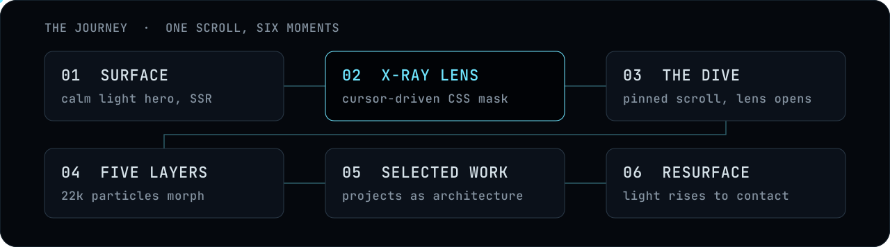

<a name="stack"></a>

<picture>
  <source media="(prefers-color-scheme: dark)" srcset="docs/readme/section-stack-dark.svg">
  
</picture>

Full-stack, made literal. Every product runs through the same five layers, surface to core, and the site has a scene for each. These shapes are drawn by the same code the site uses (`src/gl/shapes.ts`), not illustrated by hand:


| | Layer | What the particles become | The proof on the page |
|:-:|---|---|---|
| ◈ | **Interface** | A browser window | 99/100 PageSpeed · 99% SEO · a client web app in Ireland |
| ⬡ | **Devices** | A laptop and a phone | Flutter apps · a Rust device layer for Aethra · Tauri |
| ◇ | **Services** | A graph of services | 6 real-time modules at Zyrone · JWT + roles · WebSockets |
| ◆ | **Data** | Stacked databases | Vector memory in SQLite · PostgreSQL pipelines · MongoDB |
| ✦ | **Intelligence** | A spiral core | 44 tools behind a fail-closed permission gate |

<a name="screens"></a>

<picture>
  <source media="(prefers-color-scheme: dark)" srcset="docs/readme/section-screens-dark.svg">
  
</picture>

<div align="center">

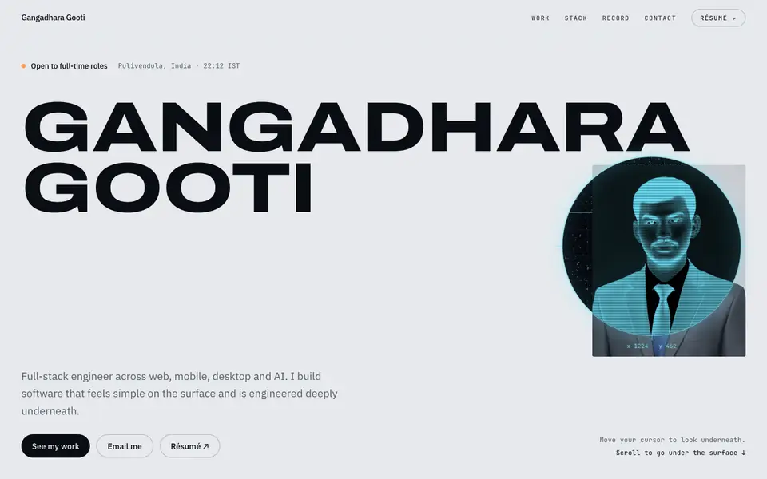

<sub>The lens and the dive, captured from the production build.</sub>

</div>

<table>
  <tr>
    <td width="50%">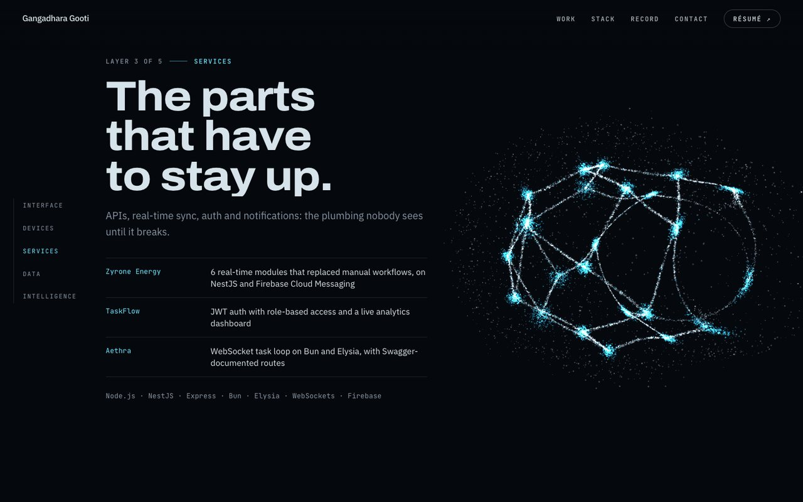</td>
    <td width="50%">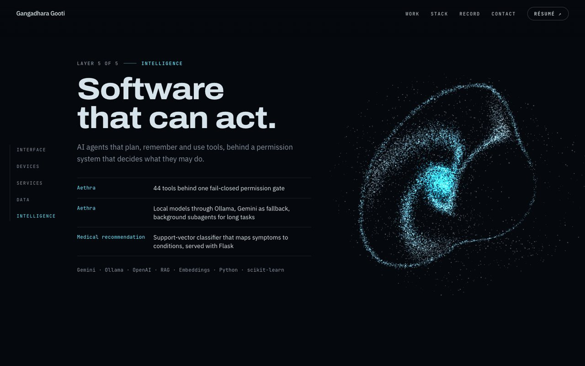</td>
  </tr>
  <tr>
    <td align="center"><sub><b>SERVICES</b> · the parts that have to stay up</sub></td>
    <td align="center"><sub><b>INTELLIGENCE</b> · software that can act</sub></td>
  </tr>
  <tr>
    <td width="50%">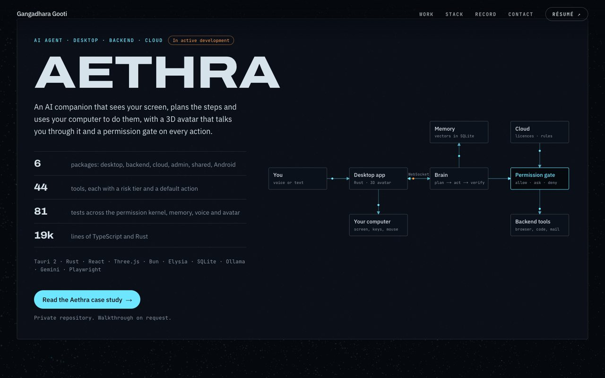</td>
    <td width="50%"></td>
  </tr>
  <tr>
    <td align="center"><sub><b>AETHRA</b> · architecture as the project cover</sub></td>
    <td align="center"><sub><b>PERMISSION GATE</b> · a working model of the kernel</sub></td>
  </tr>
</table>


<details>
<summary><b>More screens</b>: the other layers, the projects, the case study and the contact section</summary>
<br>

<table>
  <tr>
    <td width="50%">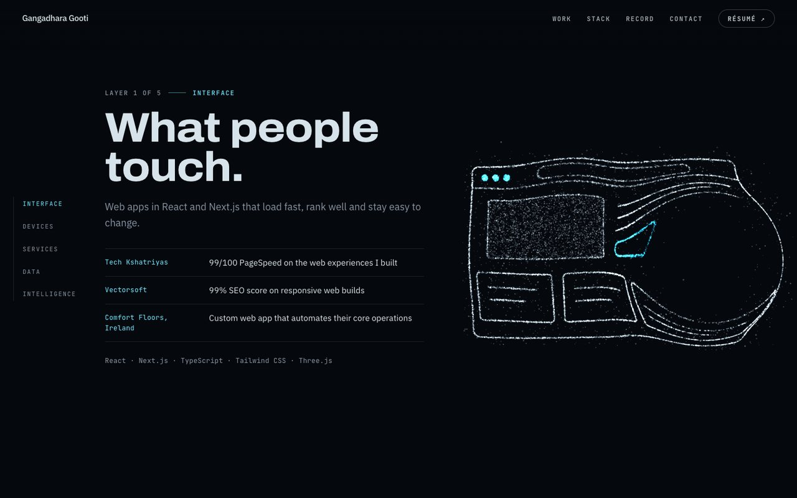</td>
    <td width="50%">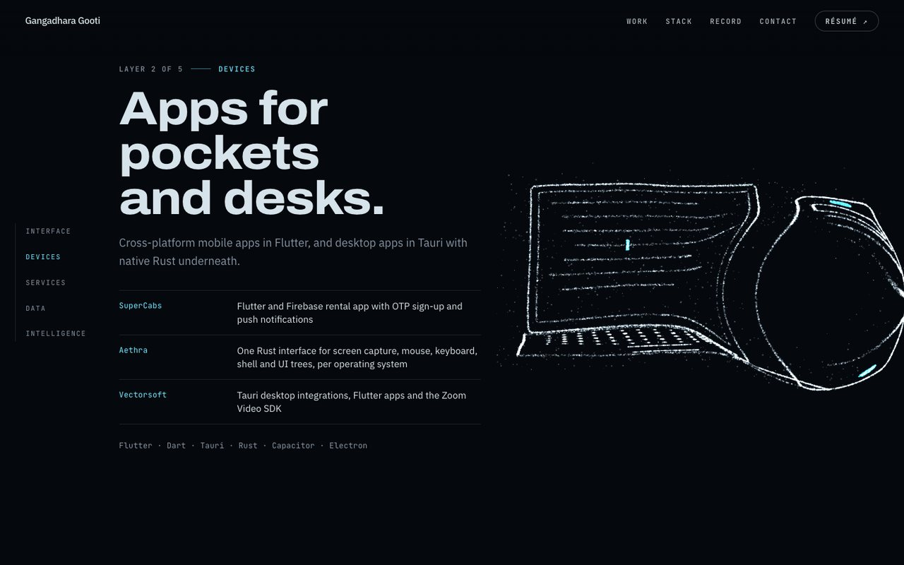</td>
  </tr>
  <tr>
    <td width="50%">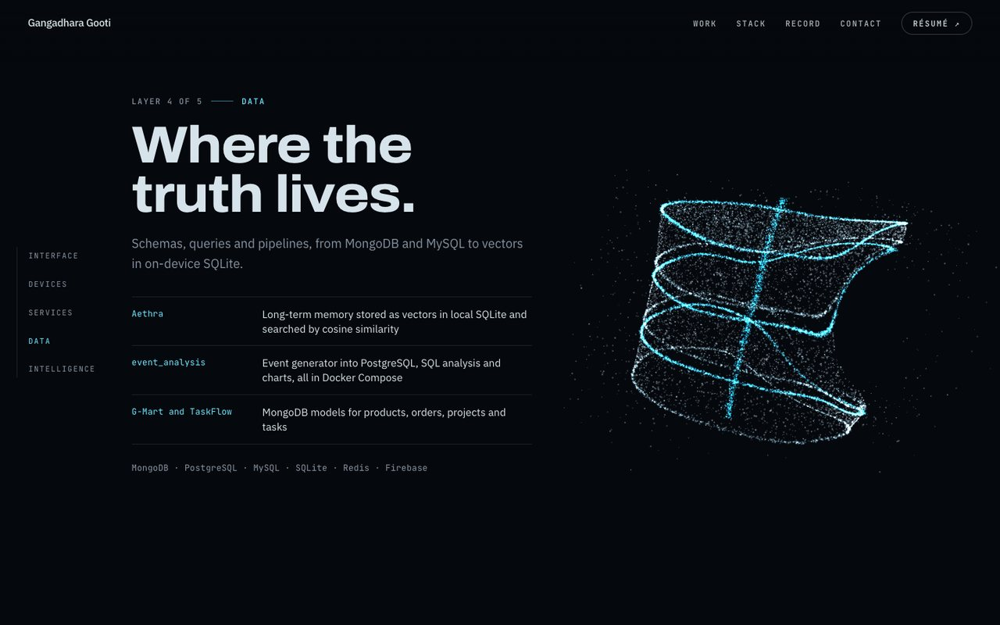</td>
    <td width="50%">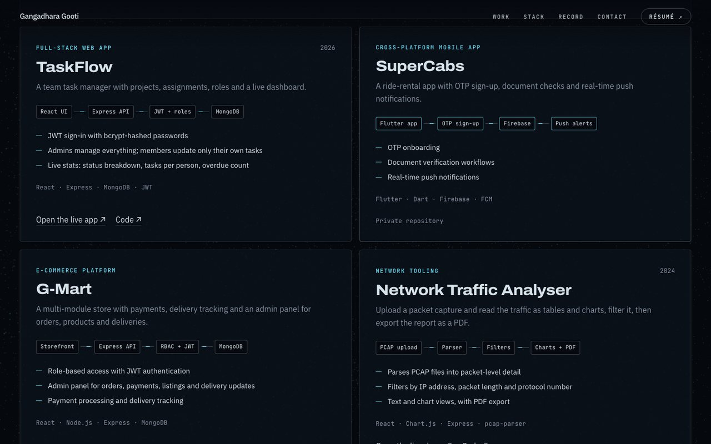</td>
  </tr>
  <tr>
    <td width="50%">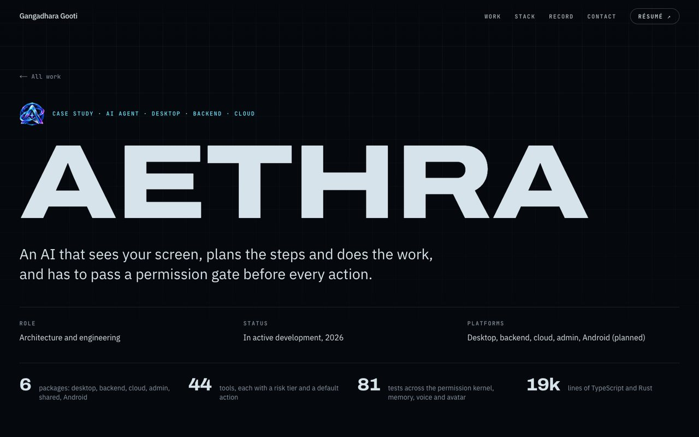</td>
    <td width="50%"></td>
  </tr>
</table>

</details>

<a name="how"></a>

<picture>
  <source media="(prefers-color-scheme: dark)" srcset="docs/readme/section-how-dark.svg">
  
</picture>

<details open>
<summary><b>◈ The lens</b>: a mask that follows the cursor</summary>
<br>

The hero is rendered twice from one server component: a light **surface** and an **X-ray** version underneath. In the X-ray version, the type is outlined with guides at Archivo's real metrics, the portrait is inverted and the markup behind the copy shows through. The surface has a CSS radial mask whose centre and radius are CSS variables, written on GSAP's ticker. The rim moves with transforms only, so tracking the cursor costs no layout work. On touch screens, the lens drifts between points of interest and jumps to a tap.

</details>

<details open>
<summary><b>◇ The dive</b>: one pinned scroll</summary>
<br>

A pinned ScrollTrigger scrubs the lens radius until it covers the screen. It fades the X-ray layer, scales the surface as you fall through it, and switches the navigation to the dark theme once the lens reaches the bar.

</details>

<details open>
<summary><b>⬡ The particles</b>: six shapes, one draw call</summary>
<br>

`src/gl/shapes.ts` generates six point clouds procedurally from seeds: dust, a browser, a laptop and phone, a service graph, a database and an AI core. Nothing is downloaded. Each shape goes to the GPU once. A morph only swaps which two buffers feed the vertex shader, which moves every particle on its own delay and stirs it with simplex noise mid-flight. The core spins around its own tilted axis, and the cursor pushes particles aside. Unit tests keep every shape inside the stage and deterministic for a given seed.

</details>

<details open>
<summary><b>✦ Staying fast</b>: effects that never cost the first paint</summary>
<br>

Every word on the page is server-rendered. three.js (tree-shaken, 136 KB gzipped) loads only after the browser goes idle, and only when WebGL runs on a real GPU. Software renderers get a static glow, because CPU-run shaders would stall the page. The shader compiles off the main thread, and particle count and pixel ratio depend on the device. A frame-time monitor lowers them if frames run slow, and ignores the pause after a tab switch.

</details>

<details open>
<summary><b>◆ Transitions</b>: the lens opens the next page</summary>
<br>

Links to the case study use React's `<ViewTransition>` with Next.js `transitionTypes`. The new page opens through a circle that grows from the exact point you clicked, while the old one recedes. The mobile menu opens the same way, from the Menu button.

</details>

<details open>
<summary><b>◉ For everyone</b>: accessibility and reduced motion</summary>
<br>

With `prefers-reduced-motion`, there is no lens, no pinning and no smooth scrolling, and the particles swap whole shapes instead of flowing. Focus is always visible, and the skip link moves focus into the page. The mobile menu moves focus in and back out and closes on <kbd>Esc</kbd>. Decorative layers are hidden from assistive technology, and the page reads fine with JavaScript off.

</details>

<a name="built"></a>

<picture>
  <source media="(prefers-color-scheme: dark)" srcset="docs/readme/section-built-dark.svg">
  
</picture>

<div align="center">

<p align="center"></p>

<p align="center">   </p>

<br>

</div>

| Lighthouse, production build | Performance | Accessibility | Best practices | SEO |
|---|:-:|:-:|:-:|:-:|
| **Desktop** | 100 | 100 | 100 | 100 |
| **Mobile** (simulated 4G, 4× CPU slowdown) | 89–90 | 100 | 100 | 100 |

<sub>Measured on 19 September 2026. Every route is prerendered as static HTML, and there are 7 runtime dependencies.</sub>

<a name="run"></a>

<picture>
  <source media="(prefers-color-scheme: dark)" srcset="docs/readme/section-run-dark.svg">
  
</picture>

```bash
npm install
npm run dev          # http://localhost:3000
npm test             # shapes, content and maths
npm run lint
npm run typecheck
npm run build && npm start
```

Requires Node 22.12 or newer.

### ◈ Edit the content

All copy lives in `src/content`, so updating the site never means touching components.

| File | What it holds |
|---|---|
| `profile.ts` | Name, headline, availability, email, links, résumé, education |
| `layers.ts` | The five stack layers, with evidence and tools for each |
| `projects.ts` | The Aethra summary, project cards (with their data-flow steps) and client sites |
| `experience.ts` | Roles, most recent first |
| `aethra.ts` | The Aethra case study, its architecture graph and the permission-gate sample |

`src/content/content.test.ts` fails on placeholder text, non-https links, duplicate slugs or a broken architecture graph. Run `npm test` after editing.

### ◇ Deploy

Import the repository on [Vercel](https://vercel.com/new); there is nothing to configure. Once a custom domain is attached, set `NEXT_PUBLIC_SITE_URL` (for example `https://gangadhara.dev`) so canonical URLs, the sitemap and share images use it.

### ⬡ Structure

```
src/
  app/          routes, metadata, share images, icons, sitemap, robots, 404
  content/      all copy and data, with integrity tests
  components/   hero, layers, work, experience, contact, case study, nav, motion
  gl/           particle shapes (tested), shaders, scene, quality tiers
  lib/          GSAP setup, maths, motion preferences, nav theme
docs/
  PLAN.md       design notes and the build checklist
  readme/       the artwork on this page
scripts/
  readme/       regenerates that artwork from the site's own fonts and shapes
```

<br>


<div align="center">
<sub>3D simplex noise by Ian McEwan and Stefan Gustavson (Ashima Arts), MIT licence. Typefaces: Archivo, IBM Plex Sans and JetBrains Mono, all under the SIL Open Font License. The artwork on this page is SVG with every word set as vector paths, so it looks the same on every device.</sub>
</div>
