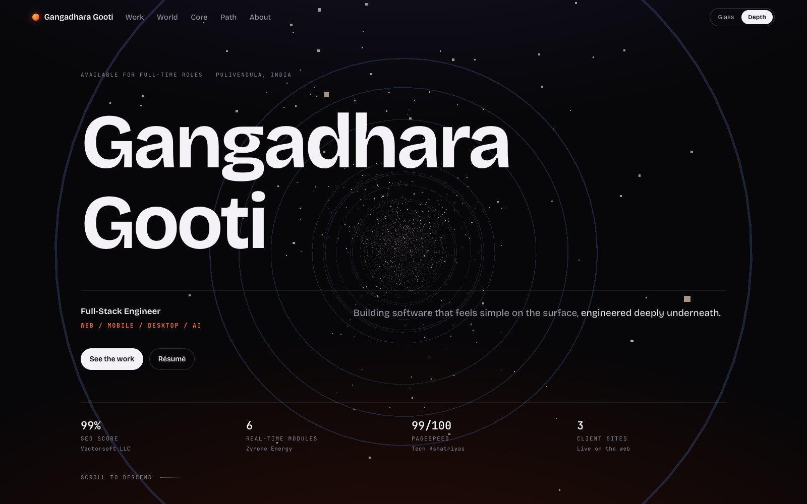
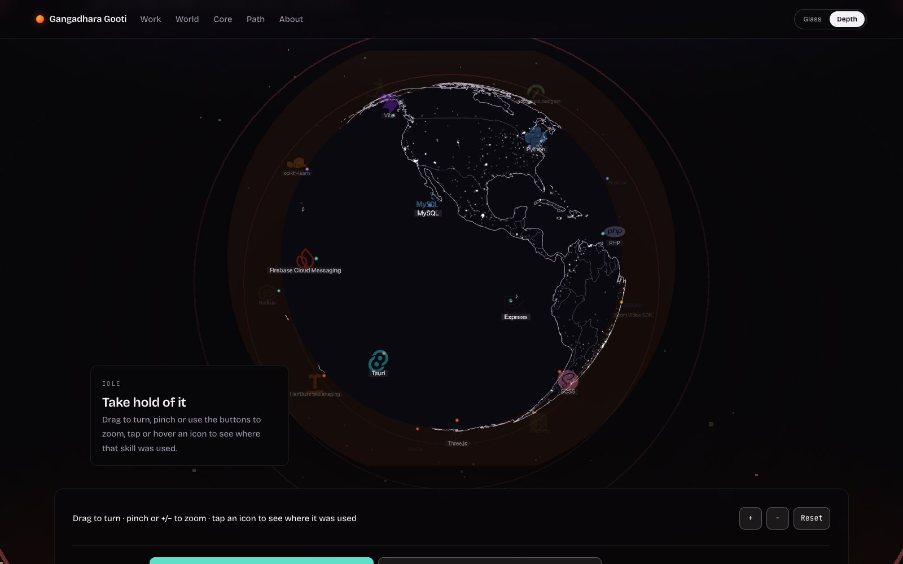
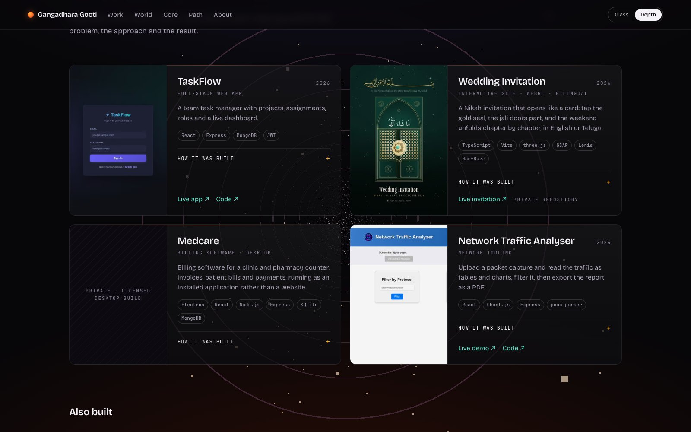
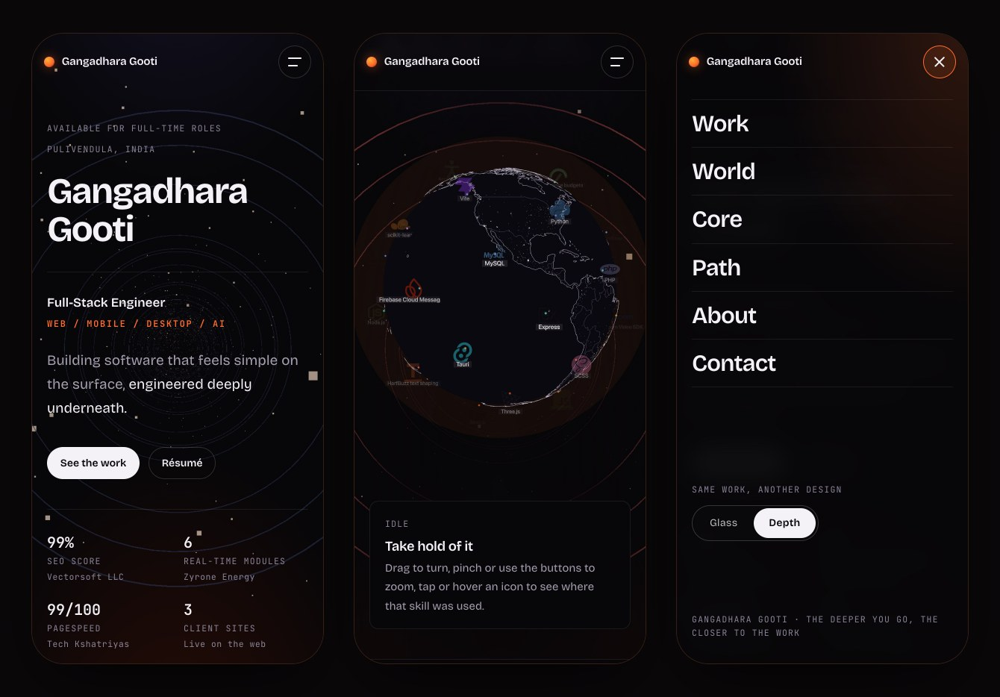

<div align="center">


<br>


<a href="https://github.com/Gangadhar-gdvs"></a>&nbsp;<a href="https://www.linkedin.com/in/gangadhar-gooti"></a>&nbsp;<a href="mailto:gangadhargdvs0@gmail.com"></a>&nbsp;<a href="https://drive.google.com/file/d/17II87o3DU8JI0LzT6W-ElN9-YTB3yFQt/view?usp=drive_link"></a>

<sub><a href="#idea">THE IDEA</a> &nbsp;·&nbsp; <a href="#stack">THE STACK</a> &nbsp;·&nbsp; <a href="#screens">SCREENS</a> &nbsp;·&nbsp; <a href="#how">HOW IT WORKS</a> &nbsp;·&nbsp; <a href="#built">BUILT WITH</a> &nbsp;·&nbsp; <a href="#run">RUN IT</a> &nbsp;·&nbsp; <a href="#designs">TWO DESIGNS</a></sub>


</div>

<a name="idea"></a>


A full-stack engineer's work lives in layers: an interface on top, then the devices it runs on, the services behind it, the data underneath, and the intelligence at the core. This portfolio makes that stack an object you can hold.

It opens on a dark stage with **five etched glass plates** stacked into one sleek slab. Up close it looks simple, like good software should. Move the cursor and a light moves across the glass. Drag and the stack turns. Scroll and it **opens up**. Each plate then slides out beside the work that proves it, and the stack closes again at the contact section.

The rule for everything here is that an effect has to earn its place as proof. The 3D is the WebGL demo. The particle section is a **load test that runs on your machine** and reports percentiles. The performance section shows this page's own numbers, live. And anyone whose device asks for reduced motion gets **Lite mode** instead: a plain, fast page, because the fastest way to lose a reader is to make them wait for a show they didn't ask for.

The same site also comes in a second design, **Depth**, one click away from the **Glass | Depth** switch in the nav. See [Two designs](#designs).

<div align="center">


<sub>Captured from the production build: the hero, then the Capabilities section.</sub>

</div>

| | Screen | What happens |
|:-:|---|---|
| 01 | **Intro** | A line of light, a count to 100, then the screen opens top and bottom like a cinema curtain. First visit only, and never in Lite mode. |
| 02 | **Hero** | The plates land one by one, foundation first. The cursor lights the glass and dragging turns it. Underneath, three numbers from the work: 3 product teams, 6 real-time modules, 99/100 PageSpeed. |
<!-- AETHRA: | 03 | **Selected work** | Aethra with its architecture and permission gate, then the lead projects as problem → approach → result, then everything else with a system sketch. | -->
| 03 | **Selected work** | The lead projects as problem → approach → result, then everything else with a system sketch, then client sites. |
| 04 | **Capabilities** | The stack opens. Each discipline pulls its plate out beside the work that proves it. |
| 05 | **The dive** | Scrolling falls the camera through the open stack to the core, letterboxed, while the line resolves from *simple on the surface* to *engineered deeply underneath*. |
| 06 | **Skills** | Every skill with the work behind it, filterable, re-laid out with a FLIP. No percentage bars. |
| 07 | **Engineering** | A load test that runs on your GPU, this page measured, an incident write-up and the decisions behind it. |
| 08 | **Experience · About** | Three product teams with the numbers, then the person, the principles and the education. |
| 09 | **Contact** | The stack closes again beside the invitation to talk. |

<a name="stack"></a>


Each plate is etched with a drawing of its layer. The drawings are generated in code when the page loads (`src/gl/stack/etch.ts`), so nothing is downloaded and they stay sharp at any size:


| | Layer | Etched on the plate | The proof on the page |
|:-:|---|---|---|
| 01 | **Frontend Engineering** | A web app mid-interaction, with a live chart | 99/100 PageSpeed · 99% SEO · a client web app in Ireland |
<!-- AETHRA: | 02 | **Mobile & Desktop Apps** | A laptop, a phone, a terminal and a video call | Flutter and Firebase apps · the Rust device layer in Aethra · Tauri | -->
| 02 | **Mobile & Desktop Apps** | A laptop, a phone, a terminal and a video call | Flutter and Firebase apps · Tauri · Medcare in Electron |
<!-- AETHRA: | 03 | **Backend & Real-time Systems** | A hub with services routed like circuit traces | 6 real-time modules at Zyrone Energy · JWT with roles · WebSockets | -->
| 03 | **Backend & Real-time Systems** | A hub with services routed like circuit traces | 6 real-time modules at Zyrone Energy · JWT with role-based access in TaskFlow |
<!-- AETHRA: | 04 | **Data & Storage** | A table, two databases and a vector search | Vector memory in SQLite · PostgreSQL pipelines · MongoDB models | -->
| 04 | **Data & Storage** | A table, two databases and a vector search | A PostgreSQL event pipeline in Docker Compose · MongoDB models for G-Mart and TaskFlow |
<!-- AETHRA: | 05 | **AI Agents & LLM Systems** | A glowing core with a dial and firing nodes | 44 tools behind one fail-closed permission gate | -->
| 05 | **AI & Machine Learning** | A glowing core with a dial and firing nodes | A symptom classifier prepared in pandas, trained with scikit-learn and served with Flask |

<a name="screens"></a>


<table>
  <tr>
    <td width="50%"></td>
    <td width="50%"></td>
  </tr>
  <tr>
    <td align="center"><sub><b>HERO</b> · the stack, closed</sub></td>
    <td align="center"><sub><b>LOAD TEST</b> · percentiles from your own GPU</sub></td>
  </tr>
  <tr>
    <!-- AETHRA: <td width="50%"></td> -->
    <td width="50%"></td>
  </tr>
  <tr>
    <!-- AETHRA: <td align="center"><sub><b>AETHRA</b> · the architecture is the cover</sub></td> -->
    <td align="center"><sub><b>PROJECTS</b> · problem → approach → result</sub></td>
  </tr>
  <tr>
    <td width="50%"></td>
    <td width="50%"></td>
  </tr>
  <tr>
    <td align="center"><sub><b>CAPABILITIES</b> · a plate for each discipline</sub></td>
    <td align="center"><sub><b>THE DIVE</b> · scroll-linked, never scroll-jacked</sub></td>
  </tr>
  <tr>
    <td width="50%"></td>
    <td width="50%"></td>
  </tr>
  <tr>
    <td align="center"><sub><b>SKILLS</b> · proof, not percentages</sub></td>
    <td align="center"><sub><b>MEASURED</b> · live, then Lighthouse</sub></td>
  </tr>
</table>


<details>
<!-- AETHRA: <summary><b>More screens</b>: decisions, the case study, experience, about and contact</summary> -->
<summary><b>More screens</b>: decisions, about, experience and contact</summary>
<br>

<table>
  <!-- AETHRA: <tr>
    <td width="50%"></td>
    <td width="50%"></td>
  </tr> -->
  <tr>
    <td width="50%"></td>
    <td width="50%"></td>
  </tr>
  <tr>
    <td width="50%"></td>
    <td width="50%"></td>
  </tr>
</table>

</details>

<a name="how"></a>


<details open>
<summary><b>◈ The stage</b>: one fixed three.js scene behind the whole page</summary>
<br>

The stack, a glossy floor with its reflection, and a little dust are drawn by one scene in plain three.js with named imports (`src/gl/Stage.ts`). The glass is a custom shader: smoked glass with a Fresnel edge, a cool key light, a warm rim from behind, and a small lamp that follows the cursor. The camera uses a long lens (26°) so the object reads clean and flat-lit, and `setViewOffset` places it beside the copy or above it on a phone without moving it in the world.

</details>

<details open>
<summary><b>◇ Etched, not textured</b>: drawings made in a canvas at load time</summary>
<br>

Each plate's drawing is made in a 2D canvas at 1,024 to 2,048 pixels, depending on the device. The canvas uses one colour channel per kind of mark: red for line work, green for accent colour, and blue for the parts that pulse. The shader colours them, runs a band of light across each plate, sends pulses diagonally, and brightens whatever sits under the cursor. Textures use anisotropic filtering, so the etching stays sharp at an angle.

</details>

<details open>
<summary><b>⬡ Scroll choreography</b>: sections steer the camera</summary>
<br>

Sections describe what the stage should do with attributes: `data-stage="hero | capabilities | contact | away"` names the framing while that section is centred, and `data-stage-focus` brings one plate forward. ScrollTrigger writes targets into a plain object, and the render loop eases toward them, so scrolling never re-renders React. The layout maths is unit-tested (`src/gl/stack/layout.test.ts`). The opaque middle of the page covers the canvas completely, and rendering stops until it is visible again.

</details>

<details open>
<summary><b>✦ Staying fast</b>: effects that never cost the first paint</summary>
<br>

Every word is server-rendered and every route is prerendered as static HTML. The motion layer (GSAP, Lenis) is imported *after* the page is interactive, which took first-load JavaScript from 242 KB to 191 KB gzipped at the time; three.js loads later still, on idle, and only when WebGL is backed by a real GPU. Software rasterisers get a vector drawing instead, because CPU-run shaders would stall the page. Nothing that is already on screen when the motion layer arrives gets animated, so no one watches text they were reading fade out and back in.

</details>

<details open>
<summary><b>◆ The load test</b>: the performance section is the benchmark</summary>
<br>

`src/gl/lab/LoadLab.ts` draws a particle field in one call and measures it: p50, p95 and p99 frame times over a rolling 600-frame window, with the first 60 frames after any change discarded. Positions come from a seed in the vertex shader, so nothing is computed per particle on the CPU and the number on screen is the GPU's answer. When the budget breaks it sheds in a fixed order — pixel ratio, then detail — and logs every step; the switch turns that off so the failure mode is visible too. It only runs while it is on screen.

</details>

<details open>
<summary><b>◈ An escape hatch</b>: Lite mode</summary>
<br>

Lite mode turns off the 3D, the smooth scrolling, the custom cursor and every reveal, leaving a plain, fast document. It is on automatically for anyone with `prefers-reduced-motion`, applied before first paint so there is no flash, and remembered per visitor. The Depth design also has a Lite switch in its footer, and the choice carries across both designs.

</details>

<details open>
<summary><b>◇ Transitions</b>: the lens opens the next page</summary>
<br>

Links to the case study use React's `<ViewTransition>` with Next.js `transitionTypes`. The new page opens through a circle that grows from the exact point you clicked, while the old one recedes. The dive is scroll-*linked*, never scroll-jacked: the scrollbar keeps working and the page never takes the wheel.

</details>

<details open>
<summary><b>◉ For everyone</b>: accessibility, reduced motion and hardening</summary>
<br>

100 on accessibility, with visible focus, a skip link, a mobile menu that traps and returns focus and closes on <kbd>Esc</kbd>, and the 3D layer hidden from assistive technology. With `prefers-reduced-motion` the site starts in Lite mode. Every response carries a Content-Security-Policy, `frame-ancestors: none`, `nosniff`, a strict referrer policy and HSTS, and CI runs lint, types, 39 tests and a production build on every push.

</details>

<a name="built"></a>


<div align="center">

<p align="center"></p>

<p align="center">   </p>

<br>

</div>

| Lighthouse, production build | Performance | Accessibility | Best practices | SEO |
|---|:-:|:-:|:-:|:-:|
| **Home, desktop** | 99 | 100 | 100 | 100 |
| **Home, mobile** (simulated slow 4G, 4× CPU slowdown) | 93 | 100 | 100 | 100 |
<!-- AETHRA: | **Aethra case study, mobile** | 96 | 100 | 100 | 100 | -->

<sub>The Glass design, measured with Lighthouse 12.8 on 22 September 2026 against its own production build, from a cold cache, median of three runs. First contentful paint is 0.3 s on desktop and 1.4 s on the phone profile; largest contentful paint is 0.5 s and 2.8 s, where it waits on the webfont. Layout shift is 0. Every route is prerendered as static HTML, first-load JavaScript is 198 KB gzipped across 10 chunks, and there are 7 runtime dependencies. The Depth design's numbers are in <a href="#designs">Two designs</a>.</sub>

<a name="run"></a>


```bash
npm install
npm run dev          # http://localhost:5000, the design picked in .env
npm run dev:depth    # the Depth design at /, http://localhost:5001
npm test             # content integrity, layout maths and the design switch
npm run lint
npm run typecheck
npm run build && npm start
```

Requires Node 22.12 or newer. On macOS, AirPlay Receiver also listens on port 5000, so the scripts bind to `localhost` only. Open **http://localhost:5000**, not `127.0.0.1:5000`.

<a name="designs"></a>

### ◈ Two designs, one site

The same content in two complete designs. Visitors switch between them with the **Glass | Depth** pill in the nav, or in the menu on a phone.

| Design | What it is | Where it lives |
|---|---|---|
| **Glass** (`stack`) | Dark, glass plates etched with the stack, cyan light, cursor lamp. | `/`, or `/glass` when Depth is the home page |
| **Depth** (`depth`) | A descent. The page opens like a title sequence, then scroll becomes a fall down a shaft: rings of rock pass, dust rises, and the light warms from cold at the surface to molten at the core. Halfway down, every skill is a place on a globe you can take hold of. | `/`, or `/depth` when Glass is the home page |

**Which one is the home page** is set by `NEXT_PUBLIC_DESIGN` in `.env`, which holds both lines with one commented out. Swap the `#` and restart. The other design is always one click away at its own path, and a design's own path redirects to `/` when it is already the home page, so each page has one address. Both declare `/` as canonical, so search engines see one site.

```bash
npm run dev:depth                       # develop Depth as the home page
NEXT_PUBLIC_DESIGN=depth npm run build  # build it
```

**How switching stays clean.** Each design is its own root layout (`src/app/(home)`, `(glass)/glass` and `(depth)/depth`, all rendering `src/design/RootDocument.tsx`). The switch is a plain link, so opening the other design is a fresh page load that brings only that design's components, stylesheet and webfonts, and nothing from the one you left. Pointing at the switch starts fetching the page early. Addresses that match no route get a 404 from `app/global-not-found.tsx`, since there is no single layout to render one inside.

<table>
  <tr>
    <td width="50%"></td>
    <td width="50%"></td>
  </tr>
  <tr>
    <td align="center"><sub><b>SURFACE</b> · outcomes from the work, not the page's own scores</sub></td>
    <td align="center"><sub><b>THE WORLD</b> · every skill a place you can turn to</sub></td>
  </tr>
  <tr>
    <td width="50%"></td>
    <td width="50%"></td>
  </tr>
  <tr>
    <td align="center"><sub><b>WORK</b> · the story folds open on each card</sub></td>
    <td align="center"><sub><b>ON A PHONE</b> · the menu carries the switch</sub></td>
  </tr>
</table>

**The globe** is the piece to look at. It is generated from `skills.ts` rather than drawn: each of the 40 skills is placed on a Fibonacci sphere as an **extruded 3D icon**, 36 of them brand marks from simple-icons (CC0) and 4 glyphs drawn in `scripts/globe/icons.mjs` for skills with no logo to borrow. All of them are turned into geometry with `ExtrudeGeometry`, so they carry a bevel and catch the light. Each brand mark keeps its brand colour and each drawn glyph takes its discipline's; every icon is labelled and carries the work that proves it.

You can drag to turn it, throw it and it keeps going, and zoom with a pinch, the +/− buttons or ⌘-scroll. Hovering or tapping an icon shows where that skill was used; clicking locks one, turns the globe to it and draws arcs to the rest of its discipline. It filters by discipline or by client work, the arrow keys turn it, Enter steps through and Escape lets go. One line under the globe gives the basics, and the full list folds out under *Every way to use it*. Without a GPU it is the same 40 skills as a list.

The globe is a real one. Coastlines and every border between two countries come from Natural Earth 1:50m (public domain), and the night side is GeoNames' populated places (CC BY 4.0): 4,956 cities above 90,000 people, each one's brightness taken from its population, which is why the eastern United States glows and the Sahara does not. Both are generated into modules by `npm run globe:map` and `npm run globe:lights`, so no map data is fetched at build or run time. Building the icons and lights is a long task, so it starts only when the reader is about a screen away from the globe, never during page load.

**The shaft** behind every section is one scene driven by scroll velocity, so stopping stops the fall and flicking down accelerates it. Its dust is pushed away from the cursor.

**What the page says.** The opening carries real outcomes (99% SEO at Vectorsoft, 6 real-time modules at Zyrone Energy, 99/100 PageSpeed at Tech Kshatriyas, 3 client sites) rather than the page's own scores; those sit further down in *Measured, not claimed*, with the method beside them. Section labels are plain words. Each project card shows its screenshot, a one-line summary, the stack and its links, with problem, approach and result folded under *How it was built*.

Both designs read the same files in `src/content`, so the words and the numbers can never drift apart between them. Nothing else is shared.

| Design | Desktop | Mobile | Accessibility | First-load JS | DOM |
|---|:-:|:-:|:-:|:-:|:-:|
| Glass | 99 | 93 | 100 | 198 KB / 10 chunks | 1,491 |
| Depth | 100 | 92 | 100 | 190 KB / 10 chunks | 589 |

<sub>Lighthouse 12.8 on 22 September 2026, each design measured as the home page of its own production build, cold cache, median of three runs; the mobile column is Lighthouse's phone profile (4× CPU slowdown, simulated slow 4G). First-load JavaScript is every script the initial HTML requests, gzipped. DOM is Lighthouse's element count for the whole page.</sub>

### ◈ Edit the content

All copy lives in `src/content`, so updating the site never means touching components.

| File | What it holds |
|---|---|
| `profile.ts` | Name, statement, availability, email, links, résumé, portrait, about, education |
| `layers.ts` | The five disciplines, with evidence and tools for each |
| `projects.ts` | The projects (with their captures) and client sites; the Aethra entry is kept but hidden by `showFeatured` |
| `experience.ts` | Roles, most recent first |
| `skills.ts` | Every skill with the work that proves it, and this site's own stack |
| `engineering.ts` | The Glass design's measured numbers, the optimisations, the incident and the decisions |
| `aethra.ts` | The Aethra case study data — hidden while it is in progress (`grep -rn AETHRA: src` lists every hidden line) |

The Depth design measures its own build, so its numbers live beside it in `src/design/depth/measured.ts`.

`src/content/content.test.ts` fails on placeholder text, non-https links, duplicate slugs, a capture that doesn't exist or a broken architecture graph. Run `npm test` after editing.

### ◇ Deploy

Import the repository on [Vercel](https://vercel.com/new); there is nothing to configure. Once a custom domain is attached, set `NEXT_PUBLIC_SITE_URL` (for example `https://gangadhara.dev`) so canonical URLs, the sitemap and share images use it.

### ⬡ Structure

```
src/
  app/          one root layout per design, plus icons, sitemap, robots
    (home)/     `/` in the .env design, share images, the hidden case study
    (glass)/    the Glass design at /glass
    (depth)/    the Depth design at /depth
    global-not-found.tsx   the 404 for addresses no route matches
  content/      all copy and data, with integrity tests
  design/       the switch: RootDocument, DesignSwitch, routes, the .env flag
    depth/      the Depth design: sections, chrome, styles, measured numbers,
                and gl/ (the shaft, the globe, map, lights and icon data)
  components/   the Glass design: chrome (nav, cursor, intro), hero,
                capabilities, work, skills, engineering, experience, about,
                contact, motion
  gl/           Glass's 3D stage: plates, etching, shaders, layout (tested),
                quality tiers, and the load-test renderer in gl/lab
  lib/          motion runtime (loaded on demand), Lite mode, maths, share-image assets
docs/
  PLAN.md       design notes and the build checklist
  readme/       the artwork and screens on this page
scripts/
  readme/       regenerates that artwork from the site's own fonts
  globe/        generates the globe's borders, city lights and icons
```

<br>


<div align="center">
<sub>Typefaces: Geist and Geist Mono by Vercel, and Instrument Serif, all under the SIL Open Font License. The artwork on this page is SVG with every word set as vector paths, so it looks the same on every device.</sub>
</div>
